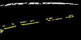

# Out-Of-Distribution Detector

## Creating training dataset

### 1. Follow the instructions [here](../README.md) to install the codebase.

### 2. Launch `vision_pipeline`

```bash
ros2 launch dt_demos vision_pipeline.launch.xml use_fake_camera:=false ood_detector:=true
```


Minimally you need the `line_detector_node` and `ood_detector_node`. 

### 3. Rosbag the results

Record the output of the ood detector using `rosbag2`.

```bash
mkdir ~/bags
cd ~/bags
ros2 bag record -o ood_training_bag ~/line_detector_node/ood_input ~/ood_detector_node/debug/crop_image
```

You can later view the `debug/crop_image` topic using `rqt_image_view` to inspect the output of the OoD detector.

### 4. Play your training video clip.

If you have a video clip that you want to turn into training images, you can use the [ros2_video_streamer](https://github.com/nicholas-gs/ros2_video_streamer) package.

```bash
ros2 launch ros2_video_streamer ros2_video_streamer_node.launch.xml image_topic_name:=/ngsduckie/camera_node/image/compressed info_topic_name:=/ngsduckie/camera_node/camera_info config_file_name:=duckiebot_camera loop:=false type:=video path:=<full path to video clip>  
```

The `ros_video_streamer` node must publish to the `camera_node/image/compressed` and `camera_node/camera_info` topics. 

### 5. Create the actual training dataset

What you have now is a "video clip" of the cropped segments (background image cropped using the Hough output segments).





But to create the actual training dataset, we need to 'split" the cropped image; each image in the dataset would contain only 1 segment. We can use the `stream_to_dataset_node` node in the `dt_ood_cps` package to help us.

```bash
# Create directory to store images
mkdir ~/ood_training_dataset

# Launch `stream_to_dataset_node` node
ros2 run dt_ood_cps stream_to_dataset_node --ros-args -p export_bin:=~/ood_training_dataset

# Replay the ros bag we created earlier.
# It may be a good idea to slow down the publish rate.
# Also need to remap the publisher topic name
ros2 bag play ~/bags/ood_training_bag --rate 5.0 --remap ~/line_detector_node/ood_input:=/stream_to_dataset_node/ood_input

# Check for a newly created directory with the created images
cd ~/ood_training_dataset
```
